# what-U-need
This is a .NET Framework MVC 5 Web Application using n-tier architecture. It is a database which can store information from users, as well as allow them to search, view, and 
save information to their favorites.

## Table of Contents
* [General info](#general-info)
* [Tables](#tables)
* [Setup](#setup)
* [Features](#features)

## General info
what-U-need was designed to provide a safe place for individuals to both find and share helpful resources for various aspects of life. The purpose is to create an ever 
growing network of useful materials to help make peoples lives better.

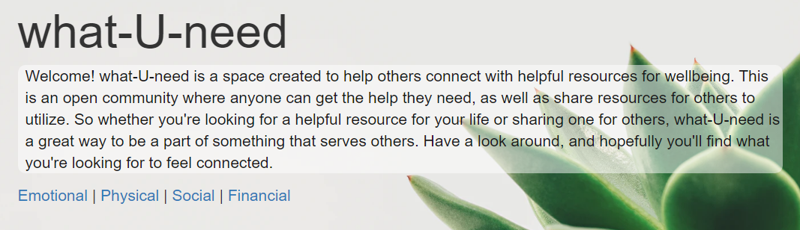

## Tables
```
Emotional
Physical
Social
Financial
Favorites
```
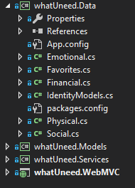

## Setup
Here's how to run this project:

```
Before you can view any of the database information you must be logged in. You can accomplish this by clicking the Log in button 
in the top right corner of the page. If this is your first time accessing the site you will have to register as a new user. You 
can accomplish this by clicking the Register button in the top right corner of the page.
```

```
Once you are logged in, you will notice that there is now a "Favorites" tab on the nav bar. This is where your favorited items 
will go. There won't be anything here yet, but you can go ahead and click on it if you would like to see how your favorites 
will be laid out.
```

```
You also now have access to the entire database! You can click on Emotional, Physical, Social, or Financial and you will see 
all of the database items within those different caregories.
```

```
Towards the top of each of these pages you will notice a "Create New" link. Simply click this link to add a new item to the 
database.
```

```
While looking at the whole list of items, you can click on either the category, title, or resource type to see the details of 
said item. Once there you have the option to edit, delete, or add to your favorites.
```

```
Once you have a/some favorited item(s), go back into your favorites and see how they show up. You now have the option to view 
details for any favorited items, as well as remove any items from your favorites.
```

## Features

### Register
```
Allows a new user to be registered.
```
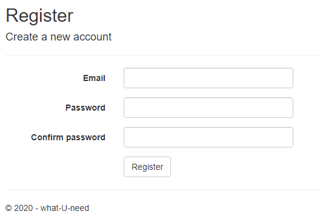

### Login
```
Allows an existing user to be logged in.
```
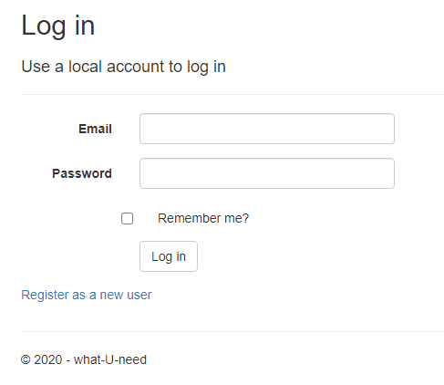

### Emotional | Physical | Social | Financial
```
Allows user to view all items of a cartain category entered in the database.
```
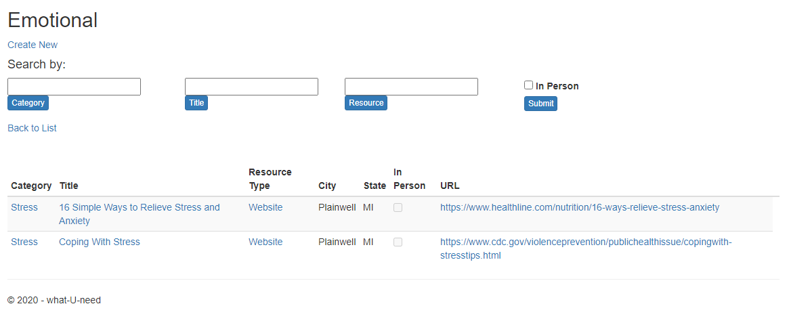

### Create New
```
Allows user to create a new database entry.
```
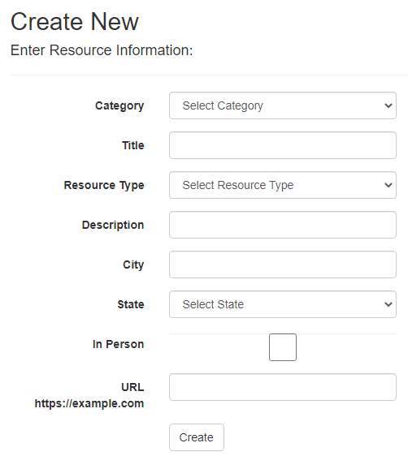

### Details
```
Allows user to view details of a specific database entry.
```
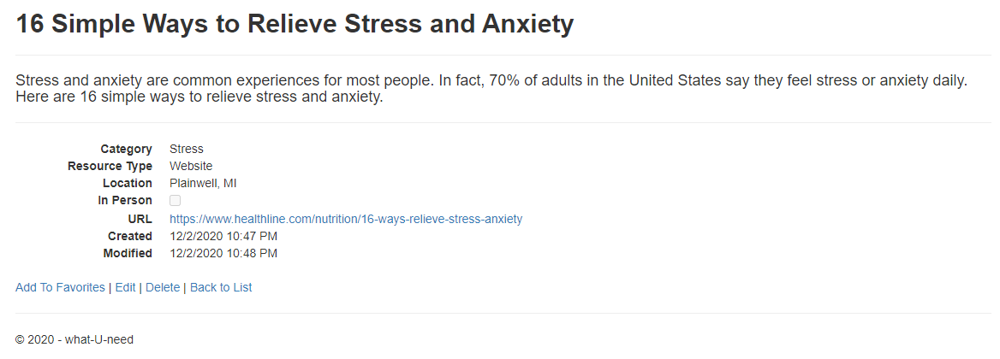

### Edit
```
Allows user to edit a specific database entry.
```
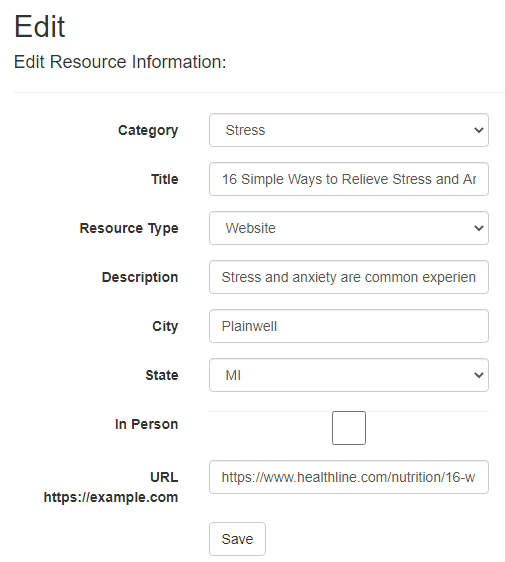

### Delete
```
Allows user to delete a specific database entry.
```
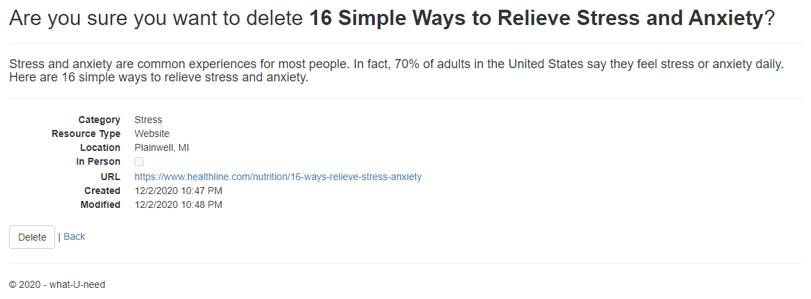

### Add To Favorites
```
Allows user to add a specific database entry to their favorites.
```
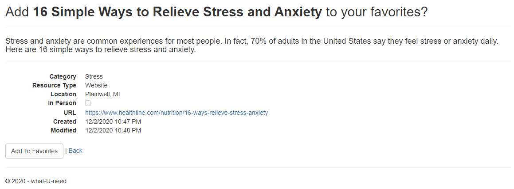

### About
```
Takes user to the about section of the site.
```
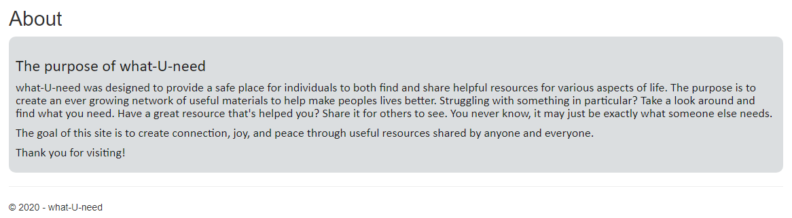

### Contact
```
Takes user to the contact section of the site.
```
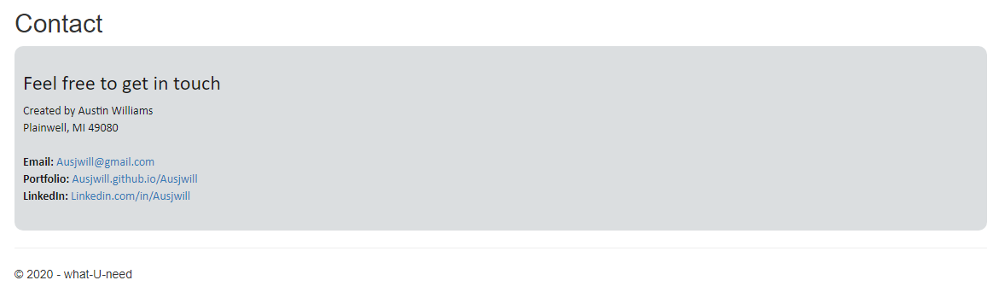

### Favorites
```
Allows user to view all database items they have added to their favorites.
```
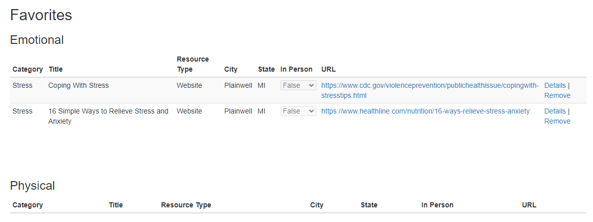
